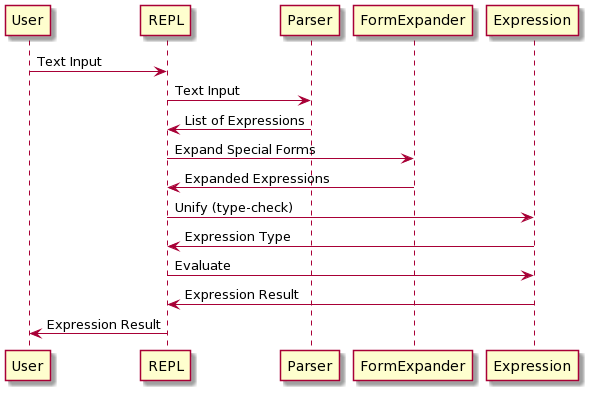

# Design
The implementation of Scheml is centered around two design patterns - Interpreter
and the Command pattern. It makes use of lambda expressions in Java both
in the definition of the simpler built-in functions such as addition,
as well as in generating JUnit tests on-the-fly using JUnit's
`DynamicTest` class.

While Scheml doesn't necessarily use as many of Java's functional
features, it certainly demonstrates the concepts of functional
programming in that it is a language with first-class functions. The
only side-effects that functions are allowed to have is I/O either to/from
the user or to/from files. There is no mutable state within the language.

## Basic Flow
Typically a user interacts with Scheml through the REPL (Read-Eval-Print Loop).
The REPL *R*eads an expression (or multiple expressions) from the user,
*E*valuates them, and then *P*rints their result, before *L*ooping back
to read more input.

This is the general flow of how the REPL interacts with the runtime system:


## Interpreter Pattern
The Interpreter pattern in Scheml is actually used for two different interpreters as shown
here in the interface definition for the Expression interface (abbreviated here):
```java
public interface Expression {
  Expression evaluate(Environment<Expression> env, boolean inTailPosition)
          throws LispException;
  void unify(TypeRef typeRef, Environment<TypeRef> env)
          throws LispException;
}
```
The `evaluate` method is for computing a result from a Scheml
expression. Here is an example implementation of an if statement, where
it evaluates the test, and then depending on whether the test is true or
false, it evaluates the true or false option.
```java
    public Expression evaluate(Environment<Expression> env, boolean inTailPosition) throws LispException {
        Expression testResult = test.evaluate(env, false);
        if (((BoolExpr)testResult).value) {
            return trueOption.evaluate(env, inTailPosition);
        } else {
            return falseOption.evaluate(env, inTailPosition);
        }
    }
```

The `unify` method is for type inference / type checking. It usually behaves
similarly to the `evaluate` method, but is only concerned with making sure that
the types are correct. In an if statement, for example, the test must be a
boolean expression, and both the true and false options must return the same
type. This is an abbreviated version of the `unify` method for an if statement:
```java

public void unify(TypeRef typeRef, Environment<TypeRef> env) throws LispException {
    // Unify the test with bool
    // If the test isn't of type bool, unify will throw a UnifyException
    TypeRef testType = new TypeRef(BooleanType.TYPE);
    test.unify(testType, env);

    // Unify the true option with the return type of the if
    trueOption.unify(typeRef, env);
    
    // Unify the false option with the return type of the if,
    // which also has the effect of unifying it with the true option
    falseOption.unify(typeRef, env);
}
```
Although it is not shown in the above example, `unify` methods usually catch
UnifyException and augment the exception with the context of what was being
unified to help identify which statements cause problems.

## Command Pattern
It could be argued that what is being called the Command pattern here is not
exactly the Command pattern from the Gang-of-Four book. The Command pattern
typically encapsulates all the information it needs so that it can just be
executed at a later time. Scheml's usage of the Command pattern still needs
to be passed some context information to actually execute the command. However,
it does show a very common pattern of having a lookup table containing
a number of objects that all implement the same interface.

### Special Forms
The first instance of a Command pattern is in how Scheml implements special
forms. In the Lisp family of languages, there are S-expressions (Symbolic Expressions)
that look like typical function applications, but have different behavior with regard
to how the parts of the S-expressions are evaluated. A typical function application
in Lisp or Scheme looks like this: `(my-function arg1 arg2)`.
An if statement in Scheml looks like a function named `if` that takes three parameters:
```
(if (> x 5)
    (printf "x is greater than 5\n")
    (printf "x is not greater than 5\n"))
```
The `(if)` here is not a function but a special form. It evaluates its first subexpression `(> x 5)`
but then only evaluates one of the other two subexpressions depending on the
result of the first subexpression. If you tried to implement `if` as a regular
function, all its arguments would be evaluated before the `if` function
was called. Here's what happens if you define a `my-if` function to try
to implement the `if` logic:
```
(define (my-if test true-option false-option)
  (if test
      true-option
      false-option))

(my-if (> 7 4)
        (printf "7 is greater than 4\n")
        (printf "4 is greater than 7\n"))
        
7 is greater than 4
4 is greater than 7

```
Notice that it prints out both messages. Because `my-if` is just
a regular function, Scheml evaluates all its arguments before calling
it. When it evaluates true-option and false-option, it executes the
`printf` statements, which is why both of them show up.

The `if` special form, and the other special forms in Scheml, are all implemented
by classes that implement the Form interface:
```java
public interface Form {
  Expression expandForm(ListExpr aList, boolean isTopLevel) throws LispException;
}
```

The `FormExpander` class sets up a table of all the special form classes, like
this:
```java
    static {
        specialForms.put("define", new DefineForm());
        specialForms.put("if", new IfForm());
        specialForms.put("lambda", new LambdaForm());
        specialForms.put("list", new ListForm());
                   .
                   .
                   .
```
When an S-expression is loaded from a file or entered in the REPL, it is first
processed by the `FormExpander`, which looks at the first item in the list
and checks to see if it is a symbol corresponding to a special form, and if so,
it invokes the `expandForm` method in that special form implementation. To add
new special forms to Scheml, you just create a new class that implements
Form and add it to the `FormExpander`'s table.

### Built-in Functions and Lambda Expressions
The other part of Scheml that uses something similar to the Command pattern, but
again requiring some bit of context, is the built-in function table. The
`BuiltinInitializer` class builds a table of built-in functions, all of which
are subclasses of `BuiltinFunctionExpr`. Many built-in functions are able
to take advantage of Java's lambda expressions, so that the function is given
as a lambda expression when creating the table:
```java
    static BuiltinFunctionExpr[] builtins = new BuiltinFunctionExpr[] {
        new BuiltinBinaryFunctionExpr<>("+", "int -> int -> int", (Long a, Long b) -> a+b),
        new BuiltinBinaryFunctionExpr<>("-", "int -> int -> int", (Long a, Long b) -> a-b),
        new BuiltinBinaryFunctionExpr<>("*", "int -> int -> int", (Long a, Long b) -> a*b),
        new BuiltinBinaryFunctionExpr<>("/", "int -> int -> int", (Long a, Long b) -> a/b),
                      .
                      .
                      .
```

## Parser
Scheml uses S-expressions for several reasons:
* Parsing is simple and straightforward
* No need to worry about operator precedence
* Easy to extend with new special forms

The parser was written very early in the development process and did not
need modification to add new special forms. You can ask the parser to
parse a string expression, or you can pass it a Reader object which might
be a FileReader. For interactive use, you can tell the parser whether or
not to prompt the user for more input, and if so, you have the option to
display a prompt. The main reason to prompt for more input is that you
might be entering a complicated expression and you forget a right
parenthesis. Since it is obvious to the parser that it needs more input,
it can ask you to enter more data. Usually when you read data from a
file the prompt is disabled since you can't really prompt a file for
more input.

## Type Inference

Type inference is a mechanism where the language figures out the types
of data items by looking at how they are used. For example, in the
expression (+ x 5), x must be an `int` because the `+` function takes
two integers as parameters. Unlike more complex functional languages,
Scheml doesn't give you a way to specify the type of variables, except
when creating abstract data types.

Type inference works here by interpreting each expression with regard
to types. That is, each type of expression knows which types need
to be the same and which can be different. The built-in functions
have known data types as well, and so can provide clues to the unification
algorithm. Here is an example function:
```
(define (add-five x)
   (+ x 5))
```
When Scheml wants to determine the type of the add-five function,
it first says "`add-five` has one parameter named `x`, I will assign
`x` an unknown type". Since a function must have a return type it says,
"I will assign the return type of `add-five` a different unknown type".
Next, it sees that `(+ x 5)` is the last value returned by the
function, so it unifies `(+ x 5)` with the unknown return type of `add-five`.
To do this, it asks the `(+ x 5)` expression to determine its type.
The `(+ x 5)` function knows already that `+` is a function that takes
two ints and returns an int. So, it unifies `x` with the type `int` so
now `x`'s type is no longer unknown, it is `int`. It also unifies 5 with `int`,
which serves as a check to make sure it is correct. If you tried to
unify the string "five" with int, that would result in an error.
Since the result of `(+ x 5)` must be the return type of the `+` function,
the type `int` is returned back to the type checker for the `add-five`
function. Now the type checker for the `add-five` function has new
information. It can see that the type of `x` has been unified with `int`
(and any further attempts to unify `x` in this function with some other
type would result in an error). Since it now knows the return type of
`(+ x 5)` it knows that its return type is `int`. That means that
the type checker for `add-five` knows that it is a function that
takes an `int` as a parameter and returns an `int` as a result, which
in Scheml is represented as `int -> int`.

In addition to the `unify` method implementation in each expression, the
type inference system relies on the classes in the `type` package that represent
the various types within Scheml. An abstract type is represented by the
`AbstractType` and `AbstractTypeDecl` classes. An `AbstractType` object 
represents the general abstract type - that is, the type with its type
parameters, but not the type constructors. An `AbstractTypeDecl` represents
the whole declaration of the abstract type including each type constructor.

The `TypeRef` class is crucial for type inference because it contains the
logic to link classes together during unification, so that if there are several
references to unknown types that turn out to all refer to the same unknown
type, they are linked together. When the type is finally determined for a type ref,
each type ref that it is linked to is automatically assigned the same type.
There are some tricky parts here because when
you copy a type that has several references that must refer to the same type,
there is some extra logic needed to preserve that linkage.

## Exhaustiveness / Usefulness Checking
Scheml supports a destructuring `match` statement that functions like
a switch or case statement in another language, and like some other strictly-typed
functional languages, it checks the match statements to see if they match
every possible value, although a non-exhaustive match statement currently
only generates a warning, and if the evaluation of a match ever fails to
match any of the patterns, the match statement will issue a fail exception.

The implementation of the exhaustiveness check uses the algorithm described
by Luc Maranget in "Warnings for Pattern Matching". Maranget's algorithm actually
determines whether or not a pattern statement is useful - that it matches something
that the patterns before it do not, and also gives a way to compute an example
pattern matched by the new pattern. In this way, Scheml is able to flag
statements as redundant, if the algorithm shows that they are not useful.
To perform exhaustiveness checking, we just check to see if "_" (the wildcard pattern)
is useful as the very last statement. If it is, then the previous statements
do not match all possible values.

## Tail Call Optimization
Most Java implementations do not provide tail call optimization, where a
function call in the tail position does not cause the stack to grow. Scheml
uses a trampoline mechanism to implement tail call optimization. Whenever
a function call is made in the tail position, rather than actually making the
call, the `ListExpr` class returns a `TailCallExpr` object. Since the function
call was made in the tail position of some other statement, the `TailCallExpr`
is returned from that other statement, and on down the call stack until
it gets to a function call that was not in the tail position. Once this happens,
the `TailCallExpr` is evaluated, performing the function call. The process
of returning the `TailCallExpr` down the call stack means that the tail call
is not using additional stack space.

You may have noticed that the second parameter to the `evaluate` method in the
Expression interface is named `inTailPosition`. This allows us to identify which
function calls are made from the tail position. The logic for whether something
is in tail position is simple:
* Starting with a function, the last statement in the function body is in tail position
* If an `if` statement is in tail position then its true and false options are in tail position
* If a `let` statement is in tail position, then its last statement is in tail position
* If a `progn` statement is in tail position, then its last statement is in tail position
* If a function call is a statement in tail position, then it is a tail call

## Unit Testing
Because it is much easier to test the various functions of Scheml from
within Scheml, the interpreter includes a dynamic unit test generator
that is able to read Scheml files from a resources directory that
contain special `(test)` forms. The `(test)` form is only available
when unit testing, as are the assert and expect expressions that
it provides. Whenever the unit tests are run, the `UnitTestsInScheml`
class looks in its resources for files under
`edu/vanderbilt/cs/wutkam/scheml/test` and runs each of them by
generating DynamicTest instances using a lambda. Each time a test
runs, the Scheml environment is reset so that they do not see any
alterations made by previous tests. This can be tricky because you
can also define functions within the test files that are visible to
any tests defined after the functions. The unit tester ensures that
the functions that should be available to the test are stored in 
the runtime environment before the test executes.