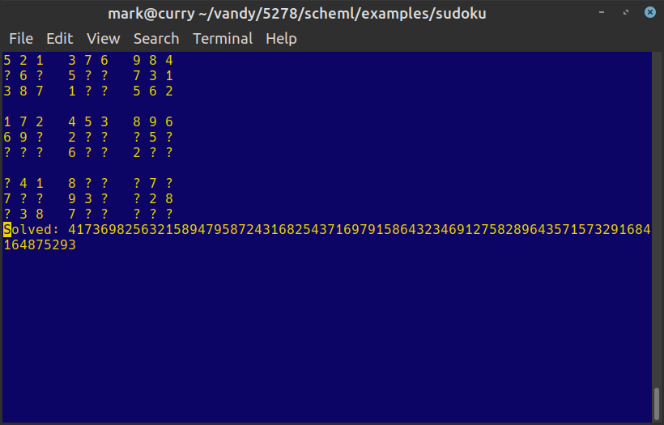

# Scheml - Scheme Syntax, ML Semantics

Scheml behaves like a subset of ML, but with a Scheme-like syntax. Some of
the features that it has that make it different from vanilla Scheme:

* Type inference and strict typing
* Algebraic data types
* Destructuring pattern matching with usefulness and exhaustiveness checking
* Partial function application (and no variadic functions that aren't special forms)
* Tail-call optimization (this is actually expected of a Scheme or ML, but it's good
  to know it is available)

## Design
Because of its length, I have moved the design description to
a [separate document](DESIGN.md).

## Building
You'll need a recent Java (I am using OpenJDK 14), and the Gradle build system.
To run the build and copy the resulting jar file to `scheml.jar` in the current
directory:
```shell
gradle copyJar
 ```

## Running
If you have done the build step above, then you can run Scheml one of two ways:

Using the `scheml` script in the root directory:
```shell
scheml
```

Or invoking Java directly:
```shell
java -jar scheml.jar
```

You should then see a prompt like this:
```shell
Scheml Repl
>
```

### Examples
The `examples` directory contains various example/test programs. Two of interest
are the geohash example and the sudoku example.

#### Geohash example
The `examples/geohash` directory contains Scheml implementations of the first
two Geohash assignments from CS 5278. The first assignment is implemented
in `geohash.scm`, while its unit tests are in `geohashtest.scm`. The
second assignment is implemented in `geohash-assignment2.scm` and its unit
tests are in `geohash-assignment2-tests.scm`. A quick way to run each of
these is with the `run-a1-tests.scm` and `run-a2-tests.scm`:
```shell
../../scheml run-a1-tests.scm
../../scheml run-a2-tests.scm
```
#### Sudoku example
The `examples/sudoku` directory contains a Scheml implementation of a
Sudoku solver. It also contains a couple of files containing easy and hard
Sudoku problems. An interesting way to enjoy the Sudoku solver is to
do this from a terminal window that supports ANSI escape sequences:
```
../../scheml sudoku.scm
>(define *sudoku-display* #t)
#t
>(solve-sudoku-file "top95.txt" "foobar.txt")
```
You should see something like this:


## A Quick Review For People Who Know Scheme
The basic forms described below should work the same way as Scheme. There
are a few differences, such as using `head` and `tail` for lists instead
of `car` and `cdr`. There are a couple of special forms that aren't in
Scheme like `:=`, `type`, and `match` and in addition to the usual types,
it also has abstract data types.

In Scheml, lists cannot contain mixed types of data - a list of ints can't
also contain some strings. One of the strengths of the Lisp family of languages
is that code and data has the same representation, which makes it easy to write
functions that transform code. This representation is referred to as an
S-expression (Symbolic expression). The Lisp `macro` and Scheme `define-syntax`
forms allow you to define functions that run at "compile time", and can take
code snippets as parameters and then spit out transformed ones.

Scheml has some support for S-expressions by defining a built in `sexpr` type
with value constructors (explained below) to create S-expressions, a
quote/unquote mechanism to define S-expressions and possibly include the values
of variables, which is often needed in macros, and also special syntax for
pattern matching. 

Because Scheml supports partial function application, there are situations
where you might use a `lambda` in Scheme that can be replaced with a
partial application. For example, to add 5 to every item in a list, instead of
the Scheme version `(map (lambda x) (+ 5 x) (list 1 2 3 4 5))` you can
just do `(map (+ 5) (list 1 2 3 4 5))`. On the other hand, because Scheml is
more strict about the types of functions, you can't make a function that takes
a variable number of arguments.

## Language Features

### Data types
Scheml supports the following data types:

#### bool
A boolean value whose representation is either `#t` or `#f`
Example:
```
#t
```

#### int
A 64-bit integer value (a Java long) currently only represented as
a decimal number (no hex/octal/binary representation yet)
Example:
```
1234567
```

#### char
A 16-bit character value (a Java char) using a Lisp-like #\a syntax. There
is currently no support for specifying characters with decimal, hex, or
binary, but there is an int->char function to create a char from an int value.
Example:
```
#\A   (the letter 'A')
```

### double
A 64-bit double-precision (Java double) value, currently only supporting
a format like _nnnnnnn.nnnnn_.
Example:
```
3.1415927
```

### string
A string of characters enclosed in double quotes. You can use \ to escape a "
and also use \n, \r, and \t as newline, carriage return, and tab.
Example:
```
"This is a string with a \" double quote and a newline\n"
```

### Algebraic Data Types
The `(type)` special form described below lets you define an algebraic data type.
You can create instances of these types with value constructors you define, and
you can use a `(match)` or in some cases `(let)` and `(progn)` to pull
individual fields from an algebraic data type.
```
(TreeNode "fred" (EmptyNode) (EmptyNode))
```

### Lists
A list is actually an instance of an Algebraic Data Type with constructors named Nil
and Cons. Those definitions are built into the language and there is some support for
displaying a list in the form (1 2 3) instead of the internal representation which
would look like `(Cons 1 (Cons 2 (Cons 3 Nil)))`. In Lisp-like languages you can
create a quoted list like `'(1 2 3)` where the elements of the list are not evaluated
or you can use a function to create a list like `(list 1 2 3)`. In Scheml, because there
are no variadic functions (functions that can take a variable number of arguments), you
can't define a `list` function that takes multiple parameters. However, there is a `list`
form that behaves like the list function in that `(list 1 2 3)` does create an expression
that is displayed as `(1 2 3)`. Likewise, `(list 1 2 3 4 5)` generates `(1 2 3 4 5)`.
Since `list` is implemented as a special form and not a function, it is able to take multiple
parameters, but this also means that since `list` isn't a function, you couldn't use it
as a parameter to a function. That is, you couldn't pass it to the `map` function like
(map list (some-func)).

There's one other important thing to realize about lists in Scheml:
**Lists cannot contain multiple types of variables**

You can't have a list of ints and strings like `(list 1 "foo" 3)`, you'll get the error:
```
Unification error:
Can't unify int with string
```

You can, on the other hand, have a list that contains items of the same Abstract Data Type
but that have multiple constructors, like `(list (Empty) (TreeNode 123 (Empty) (Empty)))`

### S-Expressions
In order to support lists that appear to be of mixed types, Scheml has a built-in
`sexpr` type that in Scheml's syntax would be defined as:
```
(type sexpr
      (SexprBool bool)
      (SexprInt int)
      (SexprChar char)
      (SexprDouble double)
      (SexprString string)
      (SexprSymbol symbol)
      (SexprList (cons sexpr)))
```

Since Scheml uses a regular single-quote in symbol names, it adopts the backtick
notation from Lisp to let you define S-expressions. For example, the following
expression defines a SexprList with several different types of values:
```
`(foo "bar" 1 2.3 #t #\a (some sub list))
```

Like Lisp, Scheml's backtick S-expression notation allows you to insert
variable values into a list. For example, the following code snippet defines
a variable and then creates an S-expression that includes the value of that
variable:
```
(define my-var "foobar")
`(some data items ,my-var)
```

The _,symbol_ notation inserts the value of a variable into the list. If the
variable refers to a list and you insert it this way, the list will be
a sub-element. For example, this code snippet defines a variable that
refers to a list and inserts it into an S-expression. Notice that the
resulting S-expression contains the list as an element:
```
Scheml Repl
>(define my-var (list 1 2 3))
(1 2 3)
>`(some data items and ,my-var too)
(some data items and (1 2 3) too)
>
```

If instead you wanted the list `(1 2 3)` inserted as elements in the list
rather than as a sub-list, use `,@` instead of just `,`:
```
Scheml Repl
>(define my-var (list 1 2 3))
(1 2 3)
>`(some data items and ,@my-var too)
(some data items and 1 2 3 too)
>
```

Since you may occasionally need to create SexprSymbol instances,
you can use the backtick followed directly by a symbol to create one:
```
`some-symbol
```
### Functions
Since Scheml is a functional language, functions are first-class data items.
You can pass them around as parameters to other functions and apply them
when you want. 

### void
Some functions such as `printf` return a void type. You may occasionally need to return a void type
in an expression. Use the symbol `void` to represent void. For example,
the `EmptyNode` option in the `match` statement below doesn't need to do anything, but its return
type must be the same as printf:
```
(match tree
   (EmptyNode void)
   ((TreeNode data _ _) (printf "tree node data is %s\n" data)))
```

### symbol (not really a type)
A symbol can be a function name or a variable name. Scheml is pretty lax in
what characters are allowed in a symbol. A symbol can't start with a digit,
and if it starts with -0 it is assumed to be a number, and if it starts
with #\ it is assumed to be a character constant, otherwise any of
these characters may appear in a symbol: `'*/+-!@#$%&_=:.<>?~|^`.
Unlike Scheme, you can't manipulate symbols as data values, and they can't
appear as types in an expression.

## Comments
The semi-colon is the comment character, and it is in effect from where it starts
until the end of the current line (unless it occurs within a string).
Example
```
(define foo 123)  ; this is a comment
```

## Special Forms
In the Lisp family of languages, special forms look like functions but their
semantics for evaluating expressions differs from that of function application.
Unlike Scheme or other Lisp-like languages, Scheml doesn't have any kind of
syntactic extension facility like macros. However, the source code is structured
in a way that makes it fairly easy to add new special forms, and the use of
S-expressions for the syntax means that you shouldn't have to modify the parser
to support a new special form.

### (:= _var_ _expr_)
The `:=` operator, also referred to as `assign` allows you to store a variable
in the current evaluation environment. It is visible to any statements that come
after it in the environment, but not outside that environment. For example,
we can use `(progn)` to create a new evaluation environment (a function body
or a let body are also evaluation environments) and if we nest them, we can see
that changes to the local environment don't affect the parent:
```
(progn                                
  (:= foo "foo level 1")
  (printf "Foo is %s\n" foo)
  (progn
    (printf "Inside nested progn, foo is currently %s\n" foo)
    (:= foo "foo level 2")
    (printf "Inside nested progn, foo is now %s\n" foo))
  (printf "Outside of nested progn, foo is now %s\n" foo))
Foo is foo level 1
Inside nested progn, foo is currently foo level 1
Inside nested progn, foo is now foo level 2
Outside of nested progn, foo is now foo level 1
```

The `:=` uses the same semantics as a `let` binding (described below) so you can
also deconstruct abstract data types with it:

```
(:= (Pair first second) (function-that-returns-a-pair))
(printf "First part is %s, second part is %s\n" first second)
```

### (define _var_ _expr_)
The `define` form lets you define either a global value or a global function.
It is possible to redefine a value with another define statement. But you
can only do this from the top level of the Scheml REPL. That is, you can't
modify global variables from within a function.
Example:
```
(define foo "this is the foo string")
```

### (define (_func-name_ _args_) _body_)
This form of `define` lets you define a global function. The items in
parentheses are the name of the function and then a list of symbols that
are the parameters to the function. A function that takes no parameters would just
have (_function-name_) in this part. The body of the function is a sequence of
statements that may use any of the symbols in the function argument list including
the function name itself. There is no special `return` statement, the return value
of a function is just the value returned by the last statement in the
function body.
Example:
```
(define (multiply-by-7 a) (* a 7))
```

### (defmacro _macro-name_ (_args_) _body_)
The `defmacro` form lets you define a macro, which is sort of a function that
runs at "compile time". Since this is an interpreter, the notion of "compile time"
is a little less defined. Basically, a macro runs at the time that special
forms are being expanded in an expression. Macros are useful because they allow
you to manipulate code before it is evaluated. For example, suppose the
`when` form described below was not available, you could reproduce it
as a macro like this:
```
(defmacro when (test &rest body)
   `(if ,test (progn ,@body void)
              void))
```
The &rest is a signal to Scheml that you want any remaining macro
arguments to be collected into a list, which will be assigned to the
parameter following &rest. If you use &rest, it should always occur
as the next-to-last item in the macro parameter list, followed only
by the name of the parameter to get the collection of remaining
parameters. If there are no additional parameters, the parameter
bound to &rest will refer to an empty list.

The `void` is there because both the true and false paths of the if statement
must have the same type, and when is expected to return a void. In case
the last statement in the `when` body does not have a type of void, the macro
goes ahead and inserts void as the last statement in the body. Even though
there's very little overhead from the `void` keyword, maybe you'd like
the macro to check to see if there is already a `void` there. You could
do something like this:
```
(define (ends-with-void body)
  (match body
    ((SexprList lst) (equals? (head (reverse lst)) `void))
    (_ #f)))

(defmacro my-when (test &rest body)
    (let ((end-void (if (ends-with-void body) `() `(void))))
      `(if ,test (progn ,@body ,@end-void) void)))
```
First the ends-with-void function returns true if the last item in
the body is the void keyword. Notice it is a function and not a macro,
macros can call functions. The `(head (reverse lst))` returns the
last item in the list. Since the body is passed to the macro as an
S-expression, the ends-with-void function uses pattern matching to
extract the body as a list, and then compares it with the SexprSymbol
`void`, which can be created using a backtick.

The my-when macro then defines an end-void symbol that either refers
to an empty list if `void` already appears in the macro body, or
`(void)` if it does not. It then splices it into the end of the `progn`
with `,@end-void`.

Because of the way macro expansion works, you cannot make a recursive
macro, but since a macro can call functions, if there is some recursive
operation you need to perform, you can always define a function to do
it and call that function from the macro.

The backquote notation in the above macros makes it easier for you
to enter literal code. Without it, the macro would have to return
a nested set of S-expressions, like:
```
(SexprList (list (SexprSymbol `if) 
  (SexprList (list (SexprSymbol `>) (SexprInt 6) (SexprInt 5)))
  (SexprList (list (SexprSymbol `progn) ...
```

### (if _test_ _true-expr_ _false-expr_)
The `(if)` special form works like it does in other Lisp-like languages. It
evaluates the _test_ expression, and if it is true, it then evaluates the
_true-expr_, and if it is false it evaluates the _false-expr_. Since Scheml is
strictly typed, both _true-expr_ and _false-expr_ must have the same type
and _test_ must be an expression with a type of `bool`.
Example:
```
(if (> x 5)
  (print "x is too big\n")
  (print "x is okay\n"))
```

### (lambda (_args_) _body_)
The `(lambda)` form defines an anonymous function (although it can be
given a name via a `(let)` or `(:=)` special form). The items
in parens after the `lambda` should be zero or more symbols representing
the names of the parameters that should be passed to the function. After
that come the statements that make up the body of the function.
The result of the last statement is also the return value of the function.
Example:
```
(lambda (a b)
  (+ (* a a) (* b b)))
```

### (let/let*/letrec ((_binding_ _expr_) ...) _body_)
The three types of `(let)` allow you to bind values to variables within the
context of a body. You can destructure abstract types with variables to extract
specific values.

The difference between `let`, `let*` and `letrec` is the scope in which the bound value
is visible. In a `let` binding the bound value is only visible in the body, it is not visible
in the let bindings that appear after it. For example:

```
(let ((foo 123)
      (bar (+ 5 foo)))   ;; <-- this is not allowed because foo is not visible until the body
  (printf "foo = %d, bar = %d\n" foo bar))
```

In a `let*` form, each binding is visible to the bindings that follow it. For example:
```
(let* ((foo 123)
      (bar (+ 5 foo)))   ;; <-- this is fine
  (printf "foo = %d, bar = %d\n" foo bar))
```

In a `letrec` form, the binding is visible within the expression being bound. This is mostly
useful for creating recursive lambda functions. For example, one common pattern in functional
languages is to make a tail-recursive version of a function that might take some extra parameters.
Here is an implementation of the factorial function that uses an accumulator for the products
so that it can be implemented tail-recursively. The tail-recursive function is implemented
as a lambda in a letrec expression, and then body of the letrec invokes the function. The outer
function then does not expose the accumulator to the user:
```
(define (fact n)
  (letrec 
      ((fact' (lambda (n acc)
                (if (< n 2) acc
                    (fact' (- n 1) (* n acc))))))
    (fact' n 1)))
```    

Note that you can use letrec to cause a stack overflow with a statement like this:
```
(letrec
  ((foo (list foo)))
  foo)
```
In the above case, you're declaring foo as a list of foo, which means it's a list of list of
foo, and so on.

As you can see in the above examples, you can bind a simple variable name to the result
of an expression. You can also unpack an abstract data type and assign its components
to variable names as well. If you don't care about a particular component, you can use `_`
as the variable name. For example, given the definition below of a Pair value constructor, you
can unpack both halves of the pair into separate variables:

```
(type pair ('a 'b) (Pair 'a 'b))
(define (func-that-returns-a-pair) (Pair "foo" 42))
(let (((Pair first-part second-part) (func-that-returns-a-pair)))
  (printf "The first part was %s and the second part %d\n"
      first-part second-part))
```
Notice that you need an extra pair of parens when deconstructing an abstract type because
the value constructor looks like a function. That is, in the previous let statements
where the binding for a simple variable was `(foo some-expression)`, the binding for an
abstract type is `((Pair foo bar) some-expression)`.

To maintain some level of type safety, the let binding currently only lets you bind
an abstract type if that type has only one constructor. If you need to work with an
abstract type that has multiple constructors, use a `(match)` form.

### (list item item item ... item)
As mentioned above, the `list` special form creates a list from any number of items.
It just creates an expression that evaluates to the abstract type
`(Cons item1 (Cons item2 (Cons item3 ... (Cons item-last Nil) ...)))`

### (match _expr_ (_pattern_ _expr) ...)
The `(match)` form allows you to deconstruct each case in an abstract type, but because
it also allows simple types in the match, it can act like a `case` or `switch` statement
in other languages. It evaluates the expression that appears just after `match` and then
looks for a pattern that matches that expression. If no patterns match, it raises an
exception.

Here is an example data type and a match statement that works with it:
```

(type tree-node ('a) 
  Empty
  (TreeNode 'a (tree-node 'a) (tree-node 'a)))

(match (function-that-returns-a-tree-node)
  (Empty (printf "The node is empty\n"))
  ((TreeNode data left right) (printf "The tree node contains data %s\n" data)))
```

Here is an example that matches simple data types:
```
(match (+ 3 4)
  (0 (printf "the result is 0\n"))
  (3 (printf "the result is 3\n"))
  (7 (printf "the result is 7\n"))
  (_ (printf "the result is something else\n"))
```

In the above example, the match will succeed against all possible values because the _
in the last pattern is a wildcard that matches anything. If you don't include that pattern,
you'll see a warning like this:
```
(match (+ 3 4)
  (0 (printf "the result is 0\n"))
  (3 (printf "the result is 3\n"))
  (7 (printf "the result is 7\n")))
the result is 7
Pattern match is not exhaustive, an unmatched pattern is 1
```
You will always get that warning when matching against ints, doubles, chars, and strings without a
wildcard because
there are too many possibilities to match (yes, if you made 65,536 matchers, you _could_ avoid
the warning for chars).

Also, if a pattern match won't ever match because one of the previous patterns already
covers that case, you'll get a different warning:
```
(match "baz"
  ("foo" (printf "it was foo\n"))
  ("bar" (printf "it was bar\n"))
  ("foo" (printf "IT WAS FOO!\n"))
  (_     (printf "it was something else\n")))
Pattern "foo" is redundant
it was something else
```

Although you could use the Cons and Nil patterns to deconstruct a list, the `match` form
also allows you to use the more familiar list notation:
```
(match (list 1 2 3)
   ((1 2 4) (printf "it was (1 2 4)"))
   ((3 2 1) (printf "it was (3 2 1)"))
   ((1 2 3) (printf "it was (1 2 3)"))
   (_ (printf "it was something else")))
```
If you are matching against a list, just know that if you don't include _ as an option,
you will get a warning about the match being incomplete because lists can essentially be
any length, so no matter how long your match is, it will always fall one short.

Finally, when deconstructing an abstract type, the match pattern can include nested patterns. Here's another
way to match the list (1 2 3)
```
(match (list 1 2 3)
  ((Cons 1 (Cons 2 (Cons 3 Nil))) (printf "It was (1 2 3)\n"))
  (_ (printf "It was something else\n")))
```

Scheml also provides a special syntax for matching against S-expressions.
First, just as you usually use the _,symbol_ notation to insert an item into
an S-expression, when matching you can use that notation to extract a value
from the S-expression. For example:
```
(match `(foo bar baz)
   (`(,f1 _ _) (printf "The first item was %s\n" f1)))
```
In this case, the ,f1 creates a match variable named f1, which when matching
against the list `(foo bar baz)` would get the value `foo` (actually
the value `SexprSymbol foo`).
Without the comma, it would try to match the symbol `f1` against the
first item in the list, which would fail since the first item is the symbol `foo`.

You can also specify what type of variable an S-expression match variable
should expect. For example, the variable f1 in the following case will
only match against an int:
```
(match `(1 2 3)
   (`(,(int f1) _ _) (printf "The first item was %d\n" f1)))
```

### (printf _format_ _args_)
You have probably been noticing all the `printf` calls in the various examples and might
have thought that `printf` is a function. But, as was the situation with the `list` form,
`printf` is a special form because it takes a variable number of arguments. 

Because Scheml is implemented in Java, the format string is the same as that specified in the
Java Formatter class here: https://docs.oracle.com/javase/7/docs/api/java/util/Formatter.html
with the exception that there is currently no support for the date/time conversions.

Since Scheml is strictly typed, it checks the types of the arguments to printf to make sure
they are correct, although the fact that the %s format in the Java Formatter can take any
object and just print the toString of it means that Scheml will allow you to pass any type
for %s. For a %d, however, the parameter must be an int, and for %f it must be a float.

### (progn _expr_ _expr_ _expr_ ... _expr_)
`progn` is probably a bit of an archaic name, but it just encapsulates a block of statements
so that the last statement is the return value of the block, similar to how `function` and
`let` bodies work.
Example:
```
(printf "Progn body returned %s\n"
   (progn (printf "running progn\n")
          (printf "still running progn\n")
          "foo"))
running progn
still running progn
Progn body returned foo

```

### (type [(_type-parameters_)] constructor constructor ...)
The `type` form lets you define abstract types. When you define an abstract type, it
may contain varying types of object (if you haven't seen this before it's like template
parameters in Java & C++), and if you do that, you need to declare type variables for
the different abstract types. For example, a list is defined internally with this type:
```
(type cons ('a) Nil (Cons 'a (cons 'a)))
```

This means that the type named `cons` has one type parameter that for the purposes of this
declaration is named `'a`. If a constructor doesn't take any arguments, it
can just be specified by its name, as `Nil` is above, while those that do take
arguments must be parenthesized, as is `(Cons 'a (cons 'a))`. It is not a
typo that the second `cons` in this example is lowercase, it doesn't refer to
the `Cons` constructor but the `cons 'a` type, meaning that could be a `Nil` or
it could be another `Cons`.

Here's an example with multiple type parameters:
```
(type pair ('a 'b) (Pair 'a 'b)
```
This is a simple pair of items where each item can be any type. For example, the
expression `(Pair "foo" 42)` has the type `(pair string int)`.

Value constructors are functions, which means you can partially evaluate them.
This `(Pair 123)` is a partial function that has the type `'a -> pair int 'a`.
That is, it is a function that takes an argument of any type and returns a
pair of an int and that type.

### (when _test_ _body_)
If the test expression returns true, `(when)` executes the body. This form
always has a type of void, because there isn't another logical choice if
the test returns false. Given that only I/O functions have side-effects,
this form isn't very useful except for printing output.

## REPL features
The REPL is mostly just a way to enter expressions and see what they
evaluate to. But, there are two special commands:

### :r _filename_
The `:r` command reads in the named file and evaluates it.

### :t _expr_
Evaluates an expression and prints its type along with its value.

### :cd _dir_
Changes the current directory to the specified directory

### :pwd
Prints the current directory

### :!_shell-command_
Executes the shell command (e.g. `:!ls` to list the files in the current
directory).

## Builtin Functions
Scheml has a number of built-in functions, mostly for dealing with strings and
numbers. Many of the common functions associated with lists are provided by
a separate lists.scm file.

### Arithmetic functions
```
(+ inta intb)
(- inta intb)
(* inta intb)
(/ inta intb)
(div inta intb)
(mod inta intb)
(+. doublea doubleb)
(-. doublea doubleb)
(*. doublea doubleb)
(/. doublea doubleb)
(div. doublea doubleb)
(mod. doublea doubleb)
```
Scheml doesn't do any kind of type conversion, and following the example of
Ocaml, it has separate operators for floating point operations. That is,
to add two ints, you use `+` but to add two doubles you use `+.`. The convention
is that the double version of an arithmetic or comparison function just has
a `.` after the int version of the same function. For example:
`(+ 3 4)` adds two integers, while `(+. 3.0 4.0)` adds two doubles.

The built-in functions can be partially applied, so `(+ 5)` is a partial
function that takes one argument and adds 5 to it. For example,
using the `map` function from `lists.scm`:
```
(map (+ 5) (list 1 2 3 4 5))
(6 7 8 9 10)
```

### Comparison functions
```
(= inta intb)
(!= inta intb)
(> inta intb)
(>= inta intb)
(< inta intb)
(<= inta intb)
(=. doublea doubleb)
(!=. doublea doubleb)
(>. doublea doubleb)
(>=. doublea doubleb)
(<. doublea doubleb)
(<=.`  doublea doubleb)
```
As with the arithmetic functions, the comparison functions also have
separate int and double versions, although this could change in the future
because the return type is always bool.

### `equals?`
```
(equals? x y)
```
Unlike the `=` comparison function, the `equals?` function can test the
equality of any two objects. It just uses the Java equals method to compare
the object, but the simple expressions in Scheml, as well as the
abstract data types, all implement the Java equals method.

### `min max min. max.`
```
(min inta intb)
(max inta intb)
(min. doublea doubleb)
(max. doublea doubleb)
```
The `min` and `max` functions pick the minimum or maximum of two ints (or two
doubles for min. and max.).

### `neg neg.`
```
(neg inta)
(neg. doublea)
```
The `neg` and `neg.` functions return the negative of an int or a double

### `int->double double->int`
```
(int->double inta)
(double->int doublea)
```
The `int->double` and `double->int` functions provide conversions between int
and double.

### `and or xor not`
```
(and boola boolb)
(or boola boolb)
(xor boola boolb)
(not boola)
```
The `and`, `or`, `xor`, and `not` functions perform the boolean operations
their names indicate. Since `and` and `or` are functions whose arguments are
evaluated before they are called, they cannot do short-circuiting. If you
need a short-circuited `and` where the second argument isn't evaluated if the
first is false, do `(if first-test second-test #f)`. Similarly, for a
short-circuited `or` do `(if first-test #t second-test)`.

### `& | ^ ~ << >>`
```scheme
(& inta intb)
(| inta intb)
(^ inta intb)
(~ inta)
(<< inta num-bits)
(>> inta num-bits)
```
The `&`, `|`, and `^` functions perform bitwise-and, -or, and -xor operations
respectively on ints. The `~` function does a bitwise invert on an int, and
`<<` and `>>` shift their first int argument left or right the number of bits
specified by their second int argument.

### `->string`
```
(->string x)
```
Converts any value to its string representation.

### `id`
```
(id x)
```
The `id` function is the identity function that just returns its argument.

### `list->string` `string->list`
```
(list->string lista)
(string->list stirnga)
```
The `list->string` and `string->list` functions convert between a string
and a list of chars (not a list of any other type).

### `cons` `head` `tail` `->list` `empty?`
```
(cons x lista)
(head lista)
(tail lista)
(->list x)
(empty? lista)
(length lista)
(nth n lista)
```
Like Scheme, Scheml uses `cons` to build a list, but it discards a piece
of Lisp history in not calling the `head` and `tail` functions `car` and
`cdr`. The `head` function returns the first item in a list, and the
`tail` function returns the rest of the list (everthing except for the
head). The `head` function will throw an exception if you try to take the
head of an empty list. The `->list` function turns any object into a one-object
list. Unlike the `(list)` form, you can map `->list` over a list to create
a list of lists.

The `empty?` function returns true if a list is empty.

The `length` function returns the length of a list.

The `nth` function takes a number n and a list and returns the item in the
list at the nth position, where the first item in the list is at position 0.

### `all` `some`
```
(all pred lista)
(some pred lista)
```
Given a predicate function of type `'a -> bool`, and a list of type `'a`,
the `all` function returns true if the predicate function returns true for
every item in the list. The `some` function returns true if the predicate
returns true for any item in the list.

### `append`
```
(append lista listb)
```
Given two lists, return the list made by appending the second list to
the end of the first.

### `drop` `take`
```
(drop n lista)
(take n lista)
```
Given an integer value n and a list of items, the `drop` function skips the first n
items of the list and returns the rest of the list. The `take` function
returns the first n items of the list as a separate list.

### `map`
```
(map f lista)
```
Given a function from `'a` to `'b` and a list of type `'a`, the `map` function
applies the function to each item of the list and returns the function results
as a list of type `'b`.

### `fold`
```
(fold f start-val lista)
```
Given a two-parameter function from types `'a` and `'b` to type`'b`, a start value of type `'b` and
a list of type `'a`, `fold` applies the function to each element of the
list and the result of the previous application (using the start value
as the second argument when invoking the function the first time). When
all the items have been processed, it returns the last function result.

For example, to sum the numbers from 1 to 10: `(fold + 0 (range 1 10))`
The calls to function + in this case would be:
```
(+ 1 0)  ; the 0 here is the second argument to fold (start-val)
(+ 2 1)  ; the 1 here is the result of the previous (+ 1 0)
(+ 3 3)
(+ 4 6)
(+ 5 10)
(+ 6 15)
(+ 7 21)
(+ 8 28)
(+ 9 36)
(+ 10 45)
```
The result of the fold would then be 55 (10 + 45)

### `member`
```
(member x lista)
```
Returns true if item x appears in the list.

### `filter`
```
(filter pred lista)
```
Given a function from type `'a` to `bool` and a list of type `'a`, `(filter)`
returns a list of all the items in the list for which the predicate was true.

### `remove`
```
(remove x lista)
```
Returns the list resulting from removing the first occurrence of item x from
the given list. If item x does not appear in the list, it will return the original list.

### `replace-nth`
```
(replace-nth n x lista)
```
Replaces the nth item in the given list with item x.

### `reverse`
```
(reverse lista)
```
Reverses the given list.

### `range`
```
(range start end)
```
The `range` function takes two arguments, a beginning and end, and returns a
list of numbers from the first argument to the last argument **inclusive**. That
is, (range 1 5) returns the list (1 2 3 4 5).

### `print`
```
(print stringa)
```
The `print` function prints a string to stdout.

### `input`
```
(input)
```
Takes no arguments, reads a line from stdin and returns it as a string
with the newline stripped off the end.

### `load`
```
(load filename)
```
The `load` function takes a string argument and loads and evaluates the
expressions in that file. It does the same thing as the `:r` command
in the REPL.

### `quit`
```
(quit)
```
Terminates the REPL.

### `read-lines` `write-lines`
```
(read-lines filenmae)
(write-lines lines filename)
```
The `read-lines` function takes a string filename and reads all the lines
from the named file, returning them as a list. The lines will have all
the newlines stripped off the end.

The `write-lines` function takes a list of strings and a string filename,
and writes each string to the named file as a separate line, appending a
newline to each string.

### `fail`
```
(fail message)
```
Takes a string message and throws an exception to terminate the current
evaluation and return the REPL. The REPL will display the message.

### `split` `join`
```
(split stringa split-on-regex)
(join string-list separator)
```
The `split` function is a thin wrapper around the Java String split method,
in that it takes a string value, and also a string representation of a
regular expression, and splits the first string at the points where it
matches the regular expression. A simple `split` call would be:
```
(split "foo bar baz" " ")
("foo" "bar" "baz")
```

The `join` function appends a list of strings together separated by
the given string separator. For example:
```
(join (list "foo" "bar" "baz") ", ")
"foo, bar, baz"
```

### `swap`
```
(swap f a b)
```
Takes a function f and two arguments a and b, and returns the result of
applying f to a and b in reverse order, that is `(f b a)`. This is useful
when working using comparison operators for list predicates. For example,
to filter a list for items less than 5, it would be nice to filter on
`(< 5)` but that would be items that 5 is less than. Instead of creating
a lambda like `(lambda (x) (< x 5))` you can just do `(swap < 5)` which
essentially does partial function application where the second argument
is partially applied.

### `profiling`
```
(profiling #t)
(profiling #f)
```
Scheml includes a very basic profiler. You activate the profiler by calling
`(profiling #t)` and then do the operations you want to profile. When you
are done, call `(profiling #f)` and that will both stop the profiling and
also print out a report of the profiling, showing the number of calls of each
function, the total time each function too, and the average time each function
took.